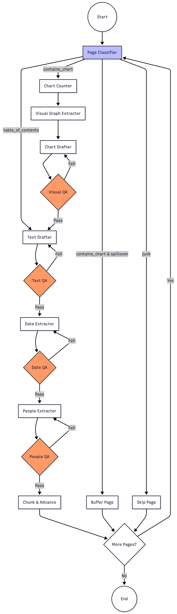

# Agentic-Doc Intelligence: PDF Parsing Multimodal Extraction & Evaluation

This project implements a sophisticated, multi-agent RAG (Retrieval-Augmented Generation) pipeline designed specifically for complex financial documents. Using **LangGraph** and **Gemini 2.5 Flash**, the system coordinates between "specialist" agents to classify pages, crop charts, transcribe tables, and self-correct via automated QA loops.

---

## 🤖 Component Functions (Nodes)

The system is built as a state-managed graph where each node performs a specific task within the `AgentState`.

### 1. Core Utilities
* **`AgentState`**: A `TypedDict` that maintains the "memory" of the agent, including the current page index, accumulated chunks, classification results, and a spillover buffer for multi-page tables.
* **`get_page_base64`**: Converts a specific PDF page into a high-resolution JPEG (300 DPI) and encodes it to base64 for the Gemini vision model.

### 2. Classification & Routing
* **`page_classifier_node`**: Analyzes the page image to determine its type: `table_of_contents`, `standard_text`, `contains_chart`, or `junk`. It also identifies when the document enters a new section or subsection to maintain hierarchical metadata.

### 3. Visual Extraction Agents
* **`chart_counter_node`**: Acts as a supervisor that scans the page to count the exact number of distinct charts, graphs, or data tables.
* **`visual_graph_extractor_node`**: Uses the count from the supervisor to locate and return bounding boxes `[ymin, xmin, ymax, xmax]` for every chart on the page. It then uses `PIL` to crop these regions into standalone images.
* **`draft_chart_node`**: Transcribes the cropped chart images into highly descriptive Markdown, ensuring every row, column, and footnote is captured without summarization.

### 4. Text & Metadata Extraction
* **`text_drafter_node`**: Extracts all text from the page and formats it into clean Markdown.
* **`date_extractor_node`**: Scans the drafted text to extract all significant dates as a comma-separated list.
* **`people_extractor_node`**: Identifies and extracts names of key individuals mentioned in the text.

### 5. Quality Assurance (QA) Loops
* **`text_qa_node` / `visual_qa_node`**: Auditors that compare the drafted Markdown against the original page image to ensure no data was missed or misread.
* **`date_qa_node` / `people_qa_node`**: Verify that extracted entities are actually present in the text and haven't been hallucinated.

### 6. Finalization
* **`chunk_and_advance_node`**: Splits the verified text into smaller chunks using a `RecursiveCharacterTextSplitter`. It attaches hierarchical metadata (Section/Subsection) and the extracted entities (Dates/People) before advancing to the next page.

---

## 🔄 The Workflow Flow

The `StateGraph` logic orchestrates the agents in a recursive loop until the entire document is processed:

1.  **Entry Point**: `classifier`.
2.  **Logic Branching**:
    * **Junk Pages**: Routed to `skip_page` and then back to the classifier for the next page.
    * **Charts/Tables**: Routed through `chart_counter` $\rightarrow$ `visual_graph_extractor` $\rightarrow$ `draft_chart` $\rightarrow$ `visual_qa`.
    * **Standard Text**: Routed directly to `text_drafter` $\rightarrow$ `text_qa`.
3.  **Refinement**: If a QA node detects an error, it sends the state back to the respective drafter with feedback for a retry (limited by `attempts`).
4.  **Enrichment**: Once the text is verified, it passes through `date_extractor` and `people_extractor`.
5.  **Completion**: The `chunk_and_advance` node saves the results and checks if more pages remain.

---


---

## 📥 Input & 📤 Output

### Input
* **PDF File**: A path to a document (e.g., `Earnings Release (FY26 Q4).pdf`).
* **Initial State**: A dictionary containing configuration like `total_pages`, `PROJECT_ID`, and `LOCATION`.

### Output: `extracted_chunks.json`
The system produces a JSON array of multimodal chunks. Each chunk contains:
* `content`: The enriched Markdown text or table.
* `type`: Either `stitched_chart` or `contextual_text`.
* `metadata`:
    * `source_page`: The original page number.
    * `section` / `subsection`: Hierarchical position in the document.
    * `extracted_dates` / `extracted_people`: Lists of entities found on that page.
    * `visual_graph_base64`: (Optional) The cropped image of a chart relevant to that chunk.

---
## Example Data comes from Walmart's FY26 Q4 Earnings Report
[See Link here.](https://stock.walmart.com/_assets/_461d6b46a29d437b51015f942ff9bb4e/walmart/db/938/9972/earnings_release/Earnings+Release+(FY26+Q4).pdf)

## 🧪 Example Test Suite

The system includes a verification suite of 20 questions used to evaluate the accuracy of the extracted data.

| Question | Ground Truth Answer (Example) |
| :--- | :--- |
| What was Walmart's total revenue for Q4 fiscal 2026? | $190.7 billion, an increase of 5.6%. |
| How much did global eCommerce sales grow? | Grew by 24%. |
| What was the size of the new share repurchase authorization? | $30 billion. |
| What is the guidance for capital expenditures in FY 2027? | Approximately 3.5% of net sales. |

### Questions must be in JSON Format
```
test_suite = [
    {
      "question": "What was Walmart's total revenue for the fourth quarter of fiscal 2026?",
      "answer": "Walmart's total revenue for the fourth quarter was $190.7 billion, representing an increase of 5.6%[cite: 979]."
    },
    {
      "question": "How much did Walmart's global eCommerce sales grow in the fourth quarter?",
      "answer": "Global eCommerce sales grew by 24%, led by store-fulfilled pickup & delivery and marketplace[cite: 980]."
    }]
```
---


## 🚀 Production Roadmap

To move this system into a production environment, consider the following steps:

1.  **Asynchronous Processing**: Implement `async` nodes in LangGraph to process multiple pages in parallel, significantly reducing processing time for long documents.
2.  **Vector Database Integration**: Replace the JSON export with a direct stream into a production vector store (e.g., Vertex AI Search or Pinecone) to enable immediate querying.
3.  **Blob Storage for Images**: Instead of storing large base64 strings in metadata, upload cropped charts to Google Cloud Storage (GCS) and store only the authenticated URL.
4.  **Observability**: Integrate **LangSmith** to monitor the graph's execution, track token costs, and identify which pages trigger the most "QA Fail" loops.
5.  **Human-in-the-loop**: Add a manual review step for pages where the agent reaches its maximum retry attempts without passing QA.

